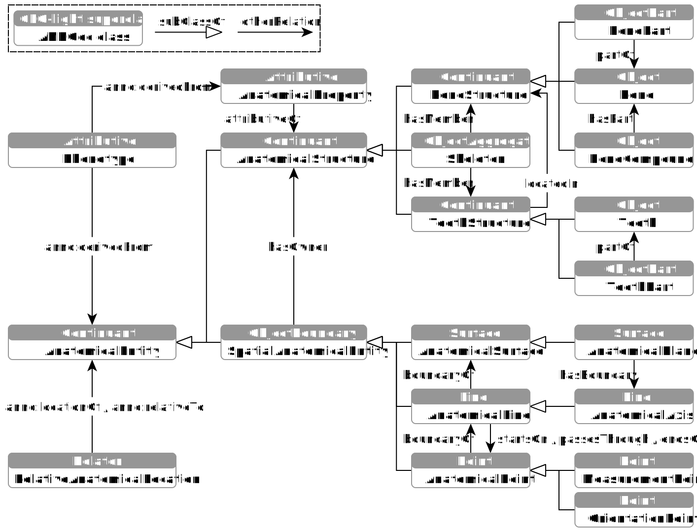

# The Anthropological Notation Ontology (ANNO)

The ANthropological Notation Ontology (ANNO) allows the systematic and standardised classification of recovered bones into the skeletal system, the description of skeletal parts and the definition of functions for deriving human phenotypes in forensic and historical anthropology.
ANNO consists of two components: ANNOdc, a domain-core ontology providing core entities such as basic anatomical categories, and ANNOds, a domain-specific ontology used to annotate structures of the human skeleton.
The development of ANNO is motivated by the need for consistent data capture, improved comparability, easier access and sustainable preservation of human skeletal remains for research and cultural heritage contexts and was co-financed from tax funds based on the budget passed by the Parliament of the Free State of Saxony.

ANNOds was embedded in ANNOdc, which in turn was originally founded with the [General Formal Ontology (GFO)](https://github.com/Onto-Med/GFO), and actually with [GFO-light](https://github.com/Onto-Med/gfo-light), i.e., the ANNOdc classes are subclasses of GFO-light classes.
Our work has shown that GFO-light is fully sufficient for describing anthropological entities, their relations, compositions and spatial locations to each other and even offers some simplifications compared to the full version of GFO.

**Fig. 1.** *ANNOdc - GFO-light embedding (overview)*

## Files

The [master](https://github.com/annosaxfdm/ontology/tree/master) branch contains the newest versions of [ANNOdc](annodc.owl) and [ANNOds](annods.owl).
RDF Turtle serializations are available in the [dist](https://github.com/annosaxfdm/ontology/tree/dist) branch:

* [anno.ttl](https://github.com/annosaxfdm/ontology/blob/dist/anno.ttl) combination of ANNOdc and ANNOds
* [anno-ols.ttl](https://github.com/annosaxfdm/ontology/blob/dist/anno-ols.ttl) combination with language tags removed, use this only with OLS 2
* [shacl.ttl](https://github.com/annosaxfdm/ontology/blob/dist/shacl.ttl) SHACL shapes for validation

## Releases

Releases have the [calendar versioning](https://calver.org/) scheme YY.MM for short year and short month.
For example, [23.08](https://github.com/annosaxfdm/ontology/releases/tag/23.11) is the state of November 2023 and contains the ontology as <https://github.com/annosaxfdm/ontology/releases/download/23.11/anno.ttl>.
You can also use the dynamic link to the newest version at <https://github.com/annosaxfdm/ontology/releases/latest/download/anno.ttl>.respectively [anno-ols.ttl](https://github.com/annosaxfdm/ontology/releases/latest/download/anno-ols.ttl).

## Validation

Install [pySHACL](https://github.com/RDFLib/pySHACL) and execute the `scripts/shacl` shell script.

## See Also

* [Project Website](https://annosaxfdm.de)
* [Paper (under development)](https://github.com/annosaxfdm/anno-paper-swj)
* [Project Website Repository](https://github.com/annosaxfdm/annosaxfdm.de)
* [Anno Ontology Lookup Service (OLS)](https://ols.imise.uni-leipzig.de/index)
* [Anno OLS Repository](https://github.com/annosaxfdm/ols)
* [OLS Synchronization Component Repository](https://github.com/annosaxfdm/olsync)
* [General Formal Ontology (GFO)](https://github.com/Onto-Med/GFO)
* [GFO-light](https://github.com/Onto-Med/gfo-light)
